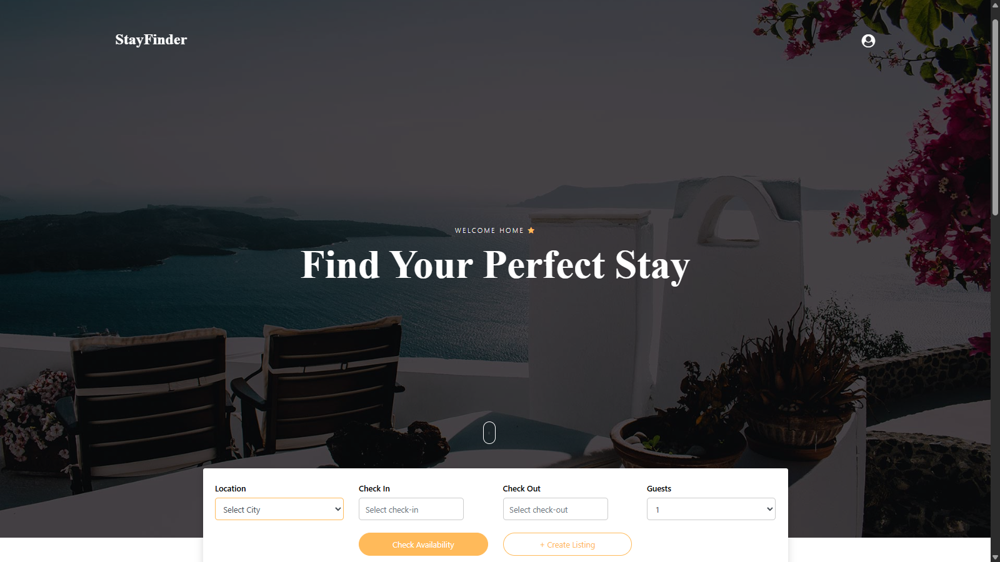
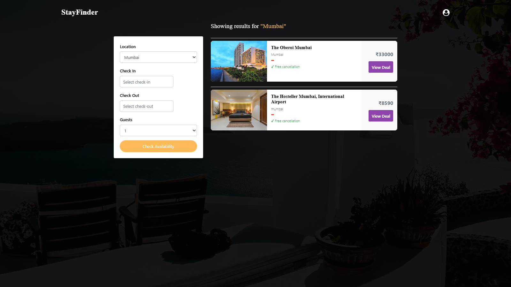
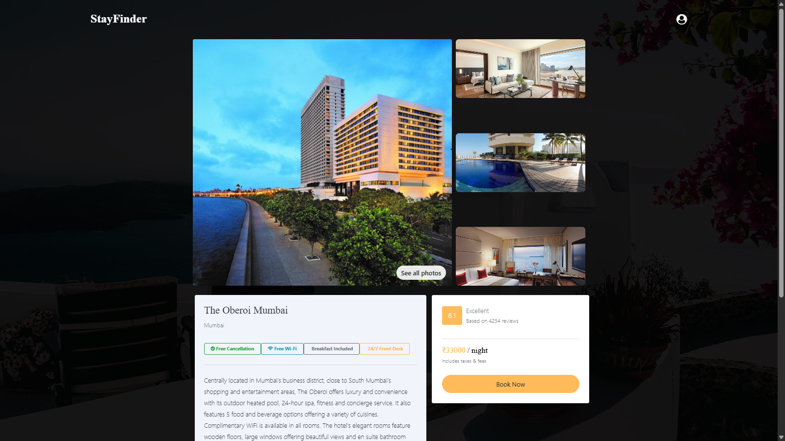
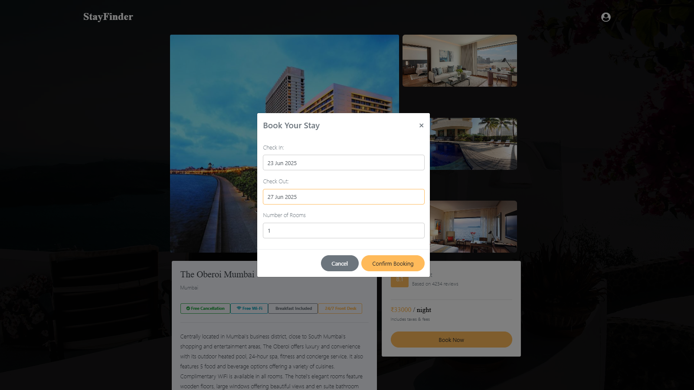
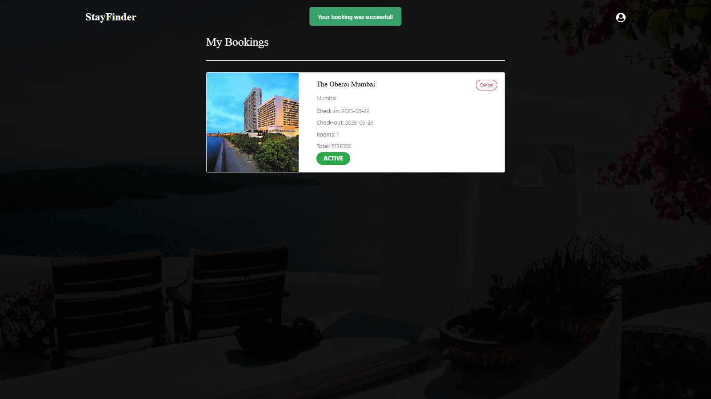
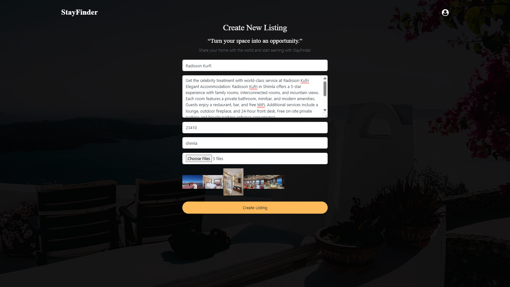
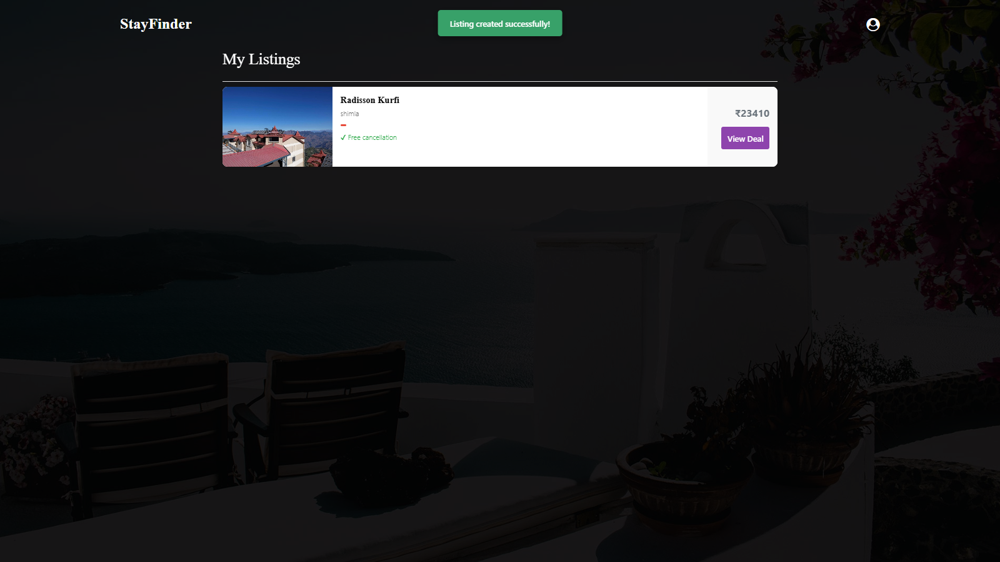
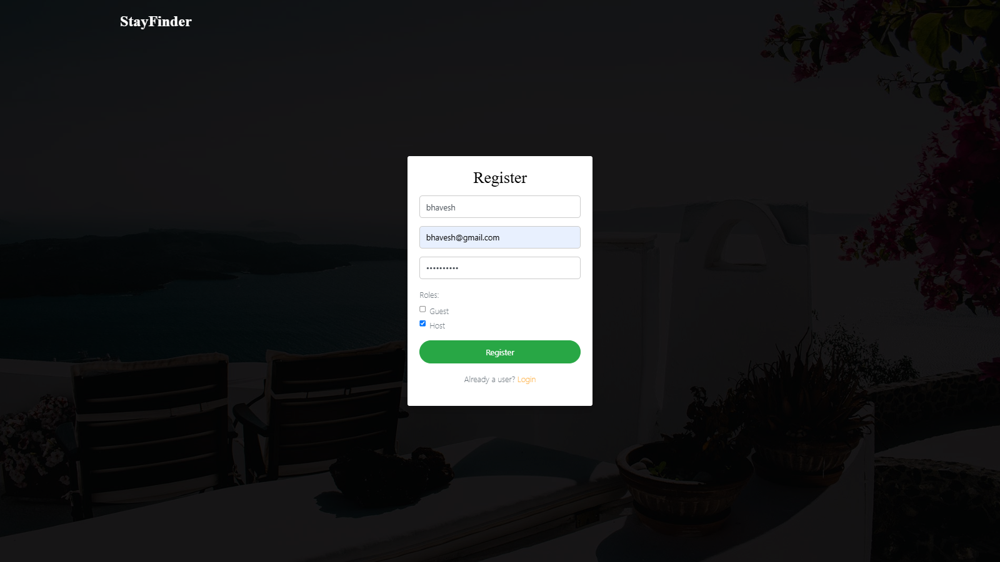
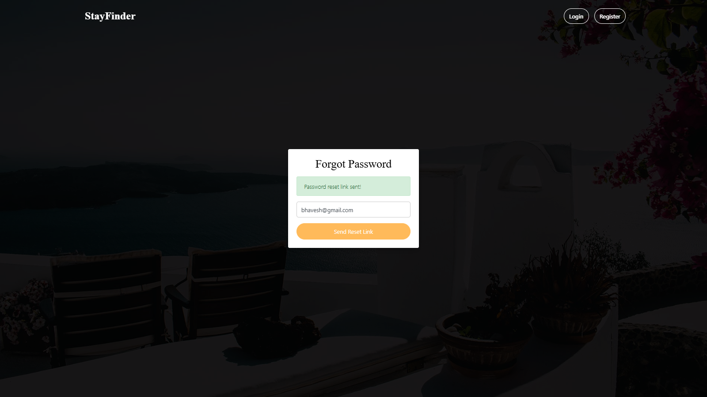

# 🏡 StayFinder - Airbnb Clone

StayFinder is a full-stack web application inspired by Airbnb. Users can browse listings, book stays, and hosts can create and manage their property listings. Built with a modern MERN stack architecture.

---

## 🚀 Features

### ✅ For Guests
- 🔍 Search stays by city
- 🏠 View detailed listing pages
- 📅 Book listings with check-in/check-out and rooms
- 📖 View your bookings
- 🔓 Login/Register with JWT auth
- 🔐 Forgot/Reset Password via Email (Mailtrap)

### 🛠️ For Hosts
- ➕ Create and manage listings
- 📷 Upload listing images to Cloudinary
- 👤 Role-based functionality (Host/Guest)
- 📄 View listings you own
- 🔐 Authorization check to prevent unauthorized edits/bookings

---

## 🧰 Tech Stack

| Frontend | Backend | Database | Others |
|----------|---------|----------|--------|
| React (Vite) | Node.js | MongoDB | Cloudinary |
| Bootstrap | Express.js | Mongoose | JWT Auth |
| Axios | Nodemailer |  | Mailtrap (Email) |

---

## 📦 Setup Instructions

### 1. Clone the Repository

```bash
git clone https://github.com/bhavesh-018/stayfinder.git
cd stayfinder
```

### 2. Setup Backend
```bash
cd stayfinder-backend
npm install
```

> Create a `.env` file in `stayfinder-backend`:

```env
PORT=5000
MONGO_URI=your_mongodb_connection_string
JWT_SECRET=your_jwt_secret
CLOUDINARY_CLOUD_NAME=your_cloud_name
CLOUDINARY_API_KEY=your_api_key
CLOUDINARY_API_SECRET=your_api_secret
MAILTRAP_USER=your_mailtrap_user
MAILTRAP_PASS=your_mailtrap_pass
```

```bash
npm run dev
```

### 3. Setup Frontend
```bash
cd stayfinder-frontend
npm install
npm start
```
---

## 📸 Screenshots

### 1. 🏠 Home Page


### 2. 🔍 Listings Page (Search Results)


### 3. 🏡 Listing Details


### 4. 🗓️ Booking Modal


### 5. 📆 My Bookings


### 6. ➕ Create Listing Form (for Hosts)


### 7. 📋 My Listings (for Hosts)


### 8. 🔐 Login / Register



### 9. 🔑 forgot / Reset Password


